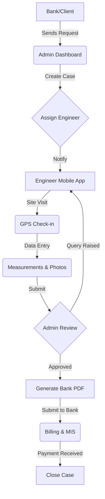
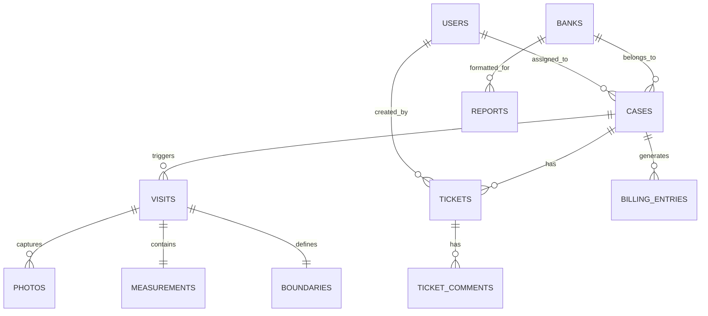

# Astron Valuation Operations Platform

## Overview
Astron Consulting Services is a bank-empanelled property valuation firm. This platform digitizes their manual workflows, enabling seamless coordination between bank portals, field engineers, and administrative staff.

The platform provides a secure, role-based environment for managing the end-to-end valuation lifecycle—from case intake and field data capture to automated report generation and financial tracking.

## Core Features
- **Role-Based Dashboards**: Tailored interfaces for Super Admins, Operations Admins, and Field Engineers.
- **Dynamic Site Visits**: Mobile-first field engineer workflow with GPS verification and categorized photo capture.
- **Bank-Specific Reporting**: Automated PDF generation for major banks (ICICI, HDFC, etc.) using `@react-pdf/renderer`.
- **Internal Ticketing**: Centralized communication system to resolve case queries and reduce reliance on external chat (WhatsApp).
- **Financial MIS**: Revenue tracking, billing status, and interactive performance charts.
- **Supabase Integration**: Robust PostgreSQL backend with real-time capabilities and edge-functions ready.

## Demo Access
The platform includes a specialized login portal for rapid testing. You can bypass traditional authentication to explore the following roles:
- **Super Admin**: Full visibility into system-wide cases, user management, and global MIS.
- **Admin**: Focus on case assignment, bank portal status tracking, and billing.
- **Field Engineer**: Mobile-optimized interface for site visits, GPS check-ins, and data capture.

## User Flow



## Entity Relationship (ER) Diagram



## Tech Stack
- **Framework**: [Next.js 15+](https://nextjs.org/) (App Router)
- **Language**: [TypeScript](https://www.typescriptlang.org/)
- **Database**: [Supabase](https://supabase.com/) (PostgreSQL)
- **Styling**: [Tailwind CSS](https://tailwindcss.com/)
- **Icons**: [Lucide React](https://lucide.dev/)
- **State Management**: [Zustand](https://docs.pmnd.rs/zustand/)
- **Charts**: [Recharts](https://recharts.org/)
- **PDF Generation**: [@react-pdf/renderer](https://react-pdf.org/)

## Setup Instructions

### 1. Prerequisites
- Node.js 18+
- Supabase CLI
- Google Maps API Key (Optional for maps)

### 2. Environment Variables
Create a `.env.local` file:
```bash
NEXT_PUBLIC_SUPABASE_URL=your_supabase_url
NEXT_PUBLIC_SUPABASE_ANON_KEY=your_anon_key
NEXT_PUBLIC_GOOGLE_MAPS_API_KEY=your_api_key
```

### 3. Database Initialization
Run the Supabase migrations:
```bash
supabase db push
```

### 4. Local Development
```bash
npm install
npm run dev
```

---
*Developed for Astron Consulting Services*
